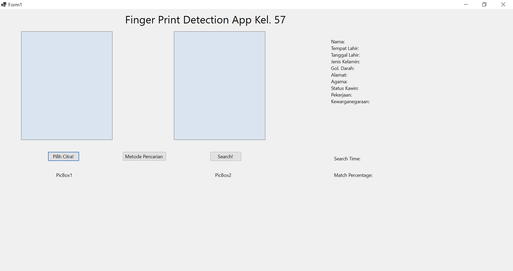

# Tubes Stima 3 by Kel57
> Fingerprint-based Biometric Identification desktop application written in C#. Based on the concept of Knuth-Morris-Pratt (KMP) and Boyer-Moore (BM) algorithm.

## Table of Contents
* [Introduction](#introduction)
* [General Information](#general-information)
* [Algorithm Implementation](#algorithm-implementation)
* [Technologies Used](#technologies-used)
* [Features](#features)
* [Overview](#overview)
* [Setup](#setup)
* [Project Status](#project-status)
* [Room for Improvement](#room-for-improvement)
* [Acknowledgements](#acknowledgements)

## Introduction
Hello, everyone! Welcome to our GitHub Repository!

This project was created by:
| No. | Name | Student ID |
| :---: | :---: | :---: |
| 1. | Tazkirah Amaliah | 10023608 |
| 2. | Nelsen Putra | 13520130 |
| 3. | Hafizh Ananta Akbari | 13522132 |
| 4. | Yosef Rafael Joshua | 13523133 |

## General Information

In this digital era, data security and access are becoming increasingly important. Development technology opens up opportunities for a variety of sophisticated and practical identification methods. Some common methods that are often used such as passwords or pins, however, have weaknesses such as being easily forgotten or stolen. Therefore, biometrics became an increasingly popular alternative security access method. One of the biometric technologies that is widely used is fingerprint identification. Everyone's fingerprints have a pattern unique and cannot be imitated, making it suitable for use as individual identity. 

Pattern matching is an important technique in fingerprint identification systems. This technique is used to match the captured fingerprint pattern with the fingerprint pattern registered in the database. The commonly used pattern matching algorithm is Bozorth and Boyer-Moore. This algorithm allows the system to recognize fingerprints quickly and accurately, even if the fingerprint captured is imperfect.

By combining fingerprint identification and pattern matching technology, it is possible to build a secure, reliable, and biometric identification system easy to use. This system can be applied in various fields, such as access control, employee attendance, and identity verification in financial transactions. In this project, we are asked to implement a system that can carry out biometric-based individual identification using fingerprints. The method that will be used to detect fingerprints is Boyer-Moore and Knuth-Morris-Pratt. Apart from that, this system will be linked to an individual's identity through a database so that the hope is to form a system that can recognize complete a person's identity just by using fingerprints.

## Algorithm Implementation
### Knuth-Morris-Pratt
The Knuth-Morris-Pratt Algorithm, shortened as the KMP Algorithm, is implemented with the usage of 2 functions which are:
1. ComputeLPSArray: Creates the Longest Prefix Suffix array to help with the KMP algorithm.
2. KMPSearch: The main function to do the KMP Algorithm with the help of the LPS array to handle mismatches.

### Boyer-Moore
The Boyer-Moore Algorithm, shortened as the BM Algorithm, is implemented with the usage of 2 functions which are:
1. BadCharHandler: This preprocesses the bad character table that is basically an array that stores the rightmost occurrence of each character in the pattern.
2. BMSearch: The main function to do the BM Algorithm by using the bad character table and a shift rule to do the comparisons and make it more efficient.

### Regular Expression
Regular Expression, also known as Regex, is implemented with the usage of 3 functions which are:
1. GetName: This gets the name from the database tabels
2. ConvertWeirdName: This converts the weird "alay" words into its supposed format
3. ConvertNameifSimilar: This determines if ConvertWeirdName will be used depending on the string

### Levenshtein Distance
Levenshtein Distance is implemented with the usage of 2 functions which are:
1. LevenshteinDistance: Calculates the Levenshtein Distance (the distance between 2 strings)
2. DifferencePercentage: Calculates the percentage of how similar both strings are

## Technologies Used
The program was written in C# using Visual Studio and *sqldatabase* for the database tool.

## Features
- [x] Receive input in the form of a fingerprint image
- [x] Identify a person's identity based on the similarity of the fingerprint image entered with that in the database using one of two different types of search algorithms, namely KMP or BM
- [x] Display a list of biodata if a fingerprint image is found that is similar to a certain percentage limit, or display information that there is no similar fingerprint if all images in the database are not similar to the input
- [x] Display the information of program execution time and the percentage of similarity between the user's fingerprint and the fingerprint in the database
- [ ] **(Bonus)** Encrypt all data in the database

## Overview

## Setup
### Installation
- Download and install [Visual Studio](https://visualstudio.microsoft.com/vs/) 
- Install the whole modules and libraries used in the source code
- Download the whole folders and files in this repository or do clone the repository

### Compilation 
1. Clone this repository in your own local directory

    `git clone https://github.com/Hapish/Tubes3_Kel57.git`

2. Open the directory in Visual Studio
    
3. In Solution Explorer, select TubeStimaTest.sln
 
4. Click Start

## Project Status
Project is: _complete_

All the specifications were implemented.

## Room for Improvement
- A faster or more efficient algorithm to make the program run quicker
- A better UI/UX to satisfy the users of this application

## Acknowledgements
- This project was based on [Spesifikasi Tugas Besar 3 Stima](https://informatika.stei.itb.ac.id/~rinaldi.munir/Stmik/2023-2024/Tubes3-Stima-2024.pdf)
- Thanks to God
- Thanks to Mr Rila Mandala, Mrs. Nur Ulfa Maulidevi, and Mr. Rinaldi as our lecturers
- Thanks to academic assistants
- This project was created to fulfill our Big Project for IF2211 Algorithm Strategies
